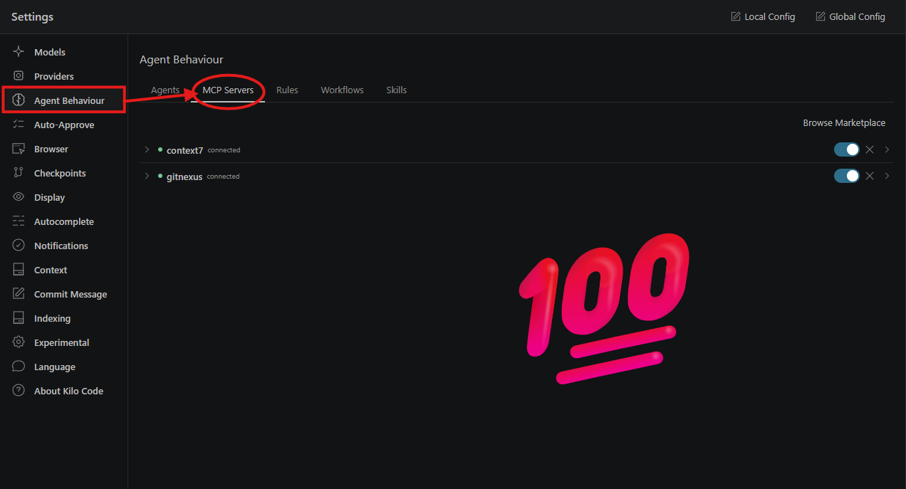

# Connect GitNexus to Kilo Code via MCP

This guide shows how to connect GitNexus to the Kilo Code VS Code extension using Kilo’s MCP support, based on a setup that has been tested successfully.

## Prerequisites

GitNexus should already be installed globally and working on the target repository, and the repository should be indexed successfully with `gitnexus analyze` before testing inside Kilo.

## Tested Versions

| Component | Version |
| --- | --- |
| VS Code | 1.125.1 (user setup) |
| Node.js | 24.15.0 |
| Kilo Code | 7.3.50 |
| OS | Windows 11 25H2 / Windows_NT x64 10.0.26200 |
| GitNexus | 1.6.7 |

## Where Kilo Stores MCP Config

Kilo Code stores MCP server configuration in its main config file. For the VS Code extension, config can be stored at either the global or project level.

| Scope | Config path |
| --- | --- |
| Global | `~/.config/kilo/kilo.jsonc` |
| Project | `kilo.jsonc` or `.kilo/kilo.jsonc` in the project root |

Check latest path : https://kilo.ai/docs/automate/mcp/using-in-kilo-code

## Add GitNexus as an MCP Server

Kilo supports local MCP servers through STDIO, and GitNexus should be added as a local server under the `mcp` key in `kilo.jsonc`. Use this configuration:

```jsonc
{
  "mcp": {
    "gitnexus": {
      "type": "local",
      "command": ["npx", "-y", "gitnexus@latest", "mcp"],
      "enabled": true,
      "timeout": 10000
    }
  }
}
```

## Check It Through the Kilo UI

1. restart kilo code extension or vs code
2. open kilo code settings
3. select mcp server section

#### From there, Kilo allows adding, editing, enabling, disabling, and deleting MCP servers, and it writes changes directly to the appropriate config file.




## Test the Connection

After configuration, Kilo automatically detects the tools exposed by the MCP server and can use them from chat once the server is available.

A practical test flow is:

1. Open the indexed repository in VS Code.
2. Confirm `gitnexus analyze`completed successfully.
3. Open Kilo chat and ask: `Use GitNexus and explain What does index.php do?`.
4. Approve the MCP tool call if prompted.

#### Full Support will be added Soon 😎

## Troubleshooting

1. If the server shows `failed`, check the CLI output and confirm the command and paths are correct.
2. If no tools appear, confirm the MCP server is enabled and GitNexus is exposing the expected tools.
3. If Kilo does not automatically select GitNexus, note the exact settings you changed and mark them as an observed workaround.
